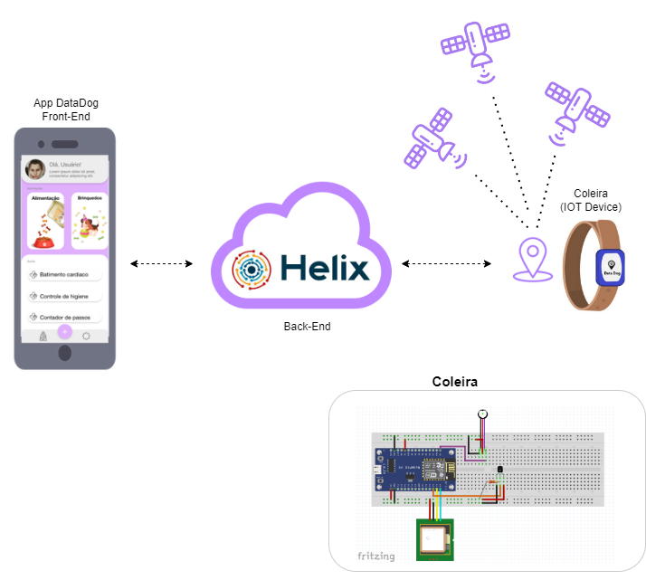

# dogma

Projeto extracurricular desenvolvido para as matérias de Gestão de Projetos e Sistemas Digitais do 5° semestre do curso de Engenharia da Computação da Faculdade Engenheiro Salvador Arena.

O projeto permite o rastreio e acompanhamento da saúde de animais de estimação através de uma coleira inteligente

## 🔨 Arquitetura do projeto!

   

    O projeto é formado pelos seguintes componentes eletrônicos:

<ul>
    <li> <strong>Sensor Óptico de Frequência Cardiaca:</strong> 
    sensor mede sua frequência cardíaca através de uma luz LED
    </li>
     
    <li> <strong>Sensor De Temperatura Digital Ds18b20:</strong> 
    realiza medições de temperatura de forma precisa
    </li>
     
    <li> <strong>Sensor Óptico de Frequência Cardiaca:</strong> 
    sensor mede sua frequência cardíaca através de uma luz LED
    </li>
     
    <li> <strong>Bateria Pack 7,4v 2600mah Sanyo:</strong> 
    bateria recarregável que permite a utilização do traje diversas vezes
    </li>
     
    <li> 
    <strong>Módulo GPS Ublox Gy-gps6mv2 Gy-neo6mv2:</strong>
    capaz de informar a localização exata do objeto em que
    o Módulo esteja instalado
    </li>
     
    <li> 
    <strong>NodeMCU ESP 8266:</strong> uma placa muito utilizado para projetos
    de IoT
    </li>
</ul>

    Os dados são enviados da coleira para a plataforma <a href='https://github.com/helix-iot/helix-sandbox'>Helix</a> que exibe os dados no aplicativo mobile

 

## 📁 Mais informações
 

    Para assistir ao Pitch do projeto <a href='https://drive.google.com/file/d/13tk7zezxFukbJxNwN7OzilY0SWLh_Ndw/view?usp=sharing'>clique aqui</a>!

 

    Para assistir a demostração do protótipo <a href='https://drive.google.com/file/d/1NZiTWuOlAUw3xSvTrLMvZBqXuYbvVwq5/view?usp=sharing'>clique aqui</a>!

 

    Para ler o artigo <a href='https://drive.google.com/file/d/16rg1jLlip0k9jAYtRRgS8trbS3rCk-14/view?usp=sharing'>clique aqui</a>!

